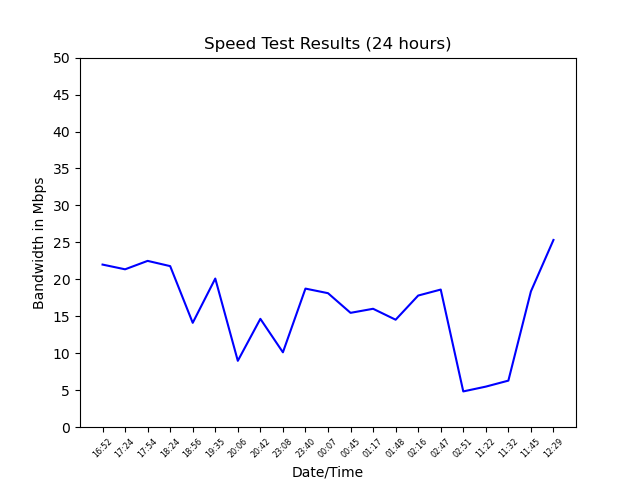

# Internet Speed Test Application

## What is this?

This work aims towards a python application that will run speed tests on the network and provide insightful results using the speedtest-cli api.

## Usage

The application comes with 3 different functions:

1. Obtain and present current internet speed test results.
2. Performing speed test on the network continually for longer periods and predict optimum browsing hour.
3. Performing speed test on the network continually and alerting the user whenever the bandwidth drops below an average/expected level.

## Requirements

Python 3.0 or higher and the following Python libraries must be installed for executing this code. 

```bash
pip install speedtest-cli
pip install schedule
pip install matplotlib
pip install csv
```

## Interpreting results

The speed test results will appear on the command prompt and also in the **internet_speed_dataset.csv** file. When the program execution is done, a plot depicting the internet speed test results over the last 24 hours will also be plotted.

The **internet_speed_dataset.csv** file contains the following for each execution (every 30 minutes):

- Timestamp
- Ping (ms)
- Download Speed (Mb/s)
- Upload Speed (Mb/s)

The **speed_test.png** image depicting the download speeds plotted against the timestamp during which it was recorded, is generated. A copy of this is also saved. 

An **alert** is also triggered whenever the speed drops below the expected or average level. Other results in the command prompt includes display of **the optimum hour for browsing** calculated using the data in the .csv file. 

## Example plot




